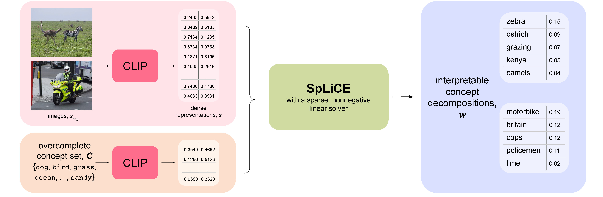
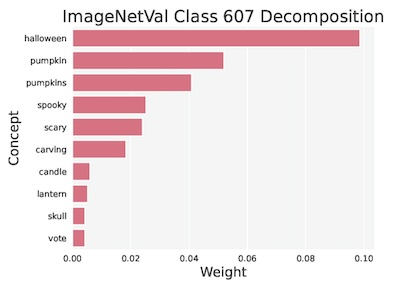

# SpLiCE
### Sparse Linear Concept Embeddings
---
Codebase for the paper 
["Interpreting CLIP with Sparse Linear Concept Embeddings (SpLiCE)" by U. Bhalla*, A. Oesterling*, S. Srinivas, F. P. Calmon^, H. Lakkaraju^]().

## Table of Contents
 * [Approach](#approach)
 * [Installation](#installation)
 * [Examples](#examples)
     * [Sample Concept Decomposition](#sample-concept-decomposition)
     * [Class/Dataset Concept Histogram](#classdataset-concept-histogram)
     * [Class/Dataset Concept Decomposition](#classdataset-concept-decomposition)
 * [API](#api)
 * [API Examples](#api-examples)
     * [Loading a SpLiCE model](#loading-a-splice-model)
     * [Decomposing and recomposition an image](#decomposing-and-recomposing-an-image)
     * [Mapping sparse weights to text vocabulary](#mapping-sparse-weights-to-text-vocabulary)
     * [Implementing your own VLM backbone or vocabulary](#implementing-your-own-vlm-backbone-or-vocabulary)
## Approach 
SpLiCE decomposes dense CLIP embeddings into **sparse, nonnegative combinations of human-interpretable, semantic concepts** that can be used for post-hoc concept based explanations, concept bottleneck models, dataset bias and spurious correlation detection, and distribution shift monitoring. 


## Installation

To install SpLiCE as a package, run the following:

```
git clone git@github.com:AI4LIFE-GROUP/SpLiCE.git
cd SpLiCE
pip install .
```


## Examples

### Sample Concept Decomposition
To get the concept decomposition of a single image (we include an example image 308175 from MSCOCO), run the `decompose_image.py` script. The `-l1_penalty` argument can be used to control the sparsity of the decompositions.

```bash
python decompose_image.py -path 000000308175.jpg -out_path image308175_decomp.txt -l1_penalty 0.25 --verbose
```


The following will be printed to the specified out path:
```
Concept Decomposition of 000000308175.jpg:
        motorbike       0.093
        police          0.0824
        britain         0.0814
        cops            0.0471
        enforcement     0.027
        officers        0.0174
        lime            0.0111
        passed          0.0068
        policeman       0.0036
Decomposition L0 Norm:      9.0
CLIP, SpLiCE Cosine Sim:    0.5363
```

### Class/Dataset Concept Histogram
To generate a concept histogram for a given class, run the script `concept_histogram.py`, which generates a bar plot of the concepts given by `decompose_data.py`. The number of concepts to be plotted can be controlled with the `-plot_topk` argument. An example histogram of the top 10 concepts from the 'jack-o-lantern' class from ImageNetVal is given below.


```bash
python concept_histogram.py -dataset ImageNetVal -out_folder imagenet_jackolantern_decomp --verbose -l1_penalty 0.3 -class_label 607 -device "cuda"
```



### Class/Dataset Concept Decomposition
To decompose an entire dataset, run the `decompose_data.py` script. An example decomposition for CIFAR-10 is shown below.  

```bash
python decompose_data.py -dataset CIFAR10 -out_path cifar10_decomp.txt -l1_penalty 0.35 --verbose
```
```
Concept Decomposition:
        frog        0.0042
        deer        0.004
        cat         0.0036
        aircraft    0.0034
        banner      0.0032
        horse       0.003
        truck       0.003
        lorry       0.0022
        icon        0.0022
        hatchback   0.0019
        insignia    0.0018
        dog         0.0016
        ...
Average Decomposition L0 Norm:      3.3622
Average CLIP, SpLiCE Cosine Sim:    0.4345
```
*Note that the poor image quality of CIFAR results in unintuitive tokens that are related to image size/quality: {icon, insignia, banner}. This is observed for other datasets with highly downsampled images but not for images of ImageNet like quality (200x200).*

This can also be done for a single class with the `-class_label` tag. Here, we show the "deer" class of CIFAR-10:

```bash
python decompose_data.py -dataset CIFAR10 -out_path cifar10_decomp.txt -l1_penalty 0.35 -class_label 4 --verbose
```

```
Concept Decomposition:
        deer        0.0397
        elk         0.0111
        fawn        0.008
        banner      0.0059
        buck        0.0056
        moose       0.0055
        foal        0.0041
        reindeer    0.0033
        ...
Average Decomposition L0 Norm:          3.246
Average CLIP, SpLiCE Cosine Sim:        0.4484
```


## API

To integrate SpLiCE in your own codebase, the `splice` module has the following functions:

1.  `splice.load(name, vocabulary, vocabulary_size, device, download_root=None, **kwargs) -> splicemodel nn.Module`:

    Returns the SpLiCE model for a supported CLIP backbone (e.g. `"open_clip:ViT-B-32"`) and concept vocabulary (e.g. `"laion"`). Note the syntax for CLIP backbone is `"[library]:[model]"`. The download root can be specified if desired, and arguments such as `return_weights` and `l1_penalty` are passed to the SpLiCE model configuration. Specifying `vocabulary_size = k` will result in decompositions over only the last k concepts in the concept set (assuming the set is sorted from least to most important). 

    * Use `splice.available_models()` to view supported CLIP backbones that can be directly loaded and used with SpLiCE. Note that additional models can easily be added as explained below.
    * `splice.get_tokenizer(name)` and `splice.get_preprocess(name)` return the associated tokenizer and image preprocessing transform for supported clip backbones. 

    * `splice.get_vocabulary(vocabulary_name)` returns a list of strings associated with a supported vocabulary.

2.  `splice.decompose_image(image, splicemodel, device) -> weights Tensor, l0_norm float, cosine_sim float`:

    Returns the splicemodel's sparse concept decomposition of the input image. Also returns the additional metrics of the l0 norm of the decomposition and the cosine similarity between the splice embedding and the original dense clip embedding. 

3.  `splice.decompose_classes(dataloader, target_label, splicemodel, device) -> weights Tensor, l0_norm float, cosine_sim float`:

    Returns the splicemodel's average sparse concept decomposition of all images in the dataloader with label `target_label`. Also returns the additional metrics of the average l0 norm of the decompositions and the aveerage cosine similarity between the splice embeddings and the original dense clip embeddings. 

4.  `splice.decompose_dataset(dataloader, splicemodel, device) -> weights Tensor, l0_norm float, cosine_sim float`:

    Returns the splicemodel's average sparse concept decomposition of all images in the dataloader. Also returns the additional metrics of the average l0 norm of the decompositions and the aveerage cosine similarity between the splice embeddings and the original dense clip embeddings. 


A SpLiCE model has the following functions:
1. `encode_image(image)`:

    Returns the concept decomposition of the preprocessed input image batch if `return_weights` is set to `True`, otherwise it returns the interpretable dense SpLiCE embedding (z_hat) that can be used as a replacement for the original dense CLIP embeddings (z). 

2. `decompose(dense_embedding) -> sparse_embedding`:

    Takes in batch of dense CLIP embeddings and outputs the sparse weight vector representations of the semantic decompositions.

3. `recompose_image(weights) -> dense_embedding`:

    Takes in a batch of sparse decompositions of embeddings and outputs dense reconstructions. 

4. `intervene_image(image, intervention_indices) -> dense embedding`

    Decomposes the preprocessed input image batch and suppresses any weights on concepts specified by the intervention_indices. Returns the recomposed dense embeddings after intervention. 

5. `forward(image, text)`

    Runs the forward pass through the splicemodels image and text encoders and returns the corresponding dense or sparse representations depending on model initialization. 


## API Examples

### Loading a SpLiCE model
Here is a basic example of loading a SpLiCE model from our supported CLIP backbones and vocabularies. We set our `l1_penalty` here to control the sparsity of the decompositions in downstream use cases.

```python
import splice

splicemodel = splice.load("open_clip:ViT-B-32", vocabulary="laion", vocabulary_size=10000, l1_penalty=0.25, device="cuda")
```

### Decomposing and recomposing an image
Here is a toy example of how to use a model initialized with `return_weights=True`, to decompose and recompose an image with `encode_image` and `recompose_image`.

```python
import splice

splicemodel = splice.load("open_clip:ViT-B-32", vocabulary="laion", vocabulary_size=10000, l1_penalty=0.25, return_weights=True, device="cuda")
preprocess = splice.get_preprocess("open_clip:ViT-B-32")

image = preprocess(Image.open(00000308175.jpg)).unsqueeze(0)

sparse_weights = splicemodel.encode_image(image)         # shape = [1, 10000], l0 norm = 9
reconstruction = splicemodel.recompose(sparse_weights)   # shape = [1, 512]
```

### Mapping sparse weights to text vocabulary
The sparse weights can be mapped back to text using the `splice.get_vocabulary` function. For example, the following lines will print the semantic decomposition of the image shown above in the example "Sample Concept Decomposition".

```python
import splice

splicemodel = splice.load("open_clip:ViT-B-32", vocabulary="laion", vocabulary_size=10000, l1_penalty=0.15, return_weights=True, device="cuda")
preprocess = splice.get_preprocess("open_clip:ViT-B-32")
vocabulary = splice.get_vocabulary("laion", 10000) 

image = preprocess(Image.open(00000308175.jpg)).unsqueeze(0)

sparse_weights = splicemodel.encode_image(image)         # shape = [1, 10000], l0 norm = 9
reconstruction = splicemodel.recompose(sparse_weights)   # shape = [1, 512]  

for weight_idx in torch.sort(sparse_weights, descending=True)[1]:
    print(f"{vocabulary[weight_idx]}: {sparse_weights[weight_idx]}")
```

### Implementing your own VLM backbone or vocabulary
If you want to construct your own splice model built on your own VLM backbone or vocabulary, you can directly construct your own splice model. All you need to provide is a module that implements `encode_image`, and `encode_text`, an estimated `image_mean` over that module, and a `dictionary` of text embeddings.

```python
import splice

vlm_backbone = VLMBackbone()
image_mean = torch.load('path/to/image_mean.pt')
vocab_path = 'path/to/vocab.txt'

## Compute embedded dictionary, mean-center and normalize
concepts = []
with open(vocab_path, "r") as f:
    lines = f.readlines()
    for line in lines:
        concepts.append(vlm_backbone.encode_text(line))
concepts = torch.nn.functional.normalize(torch.stack(concepts), dim=1)
concepts = torch.nn.functional.normalize(concepts-torch.mean(concepts, dim=0), dim=1)

splicemodel = SPLICE(image_mean, concepts, clip=vlm_backbone, device="cuda")
```
